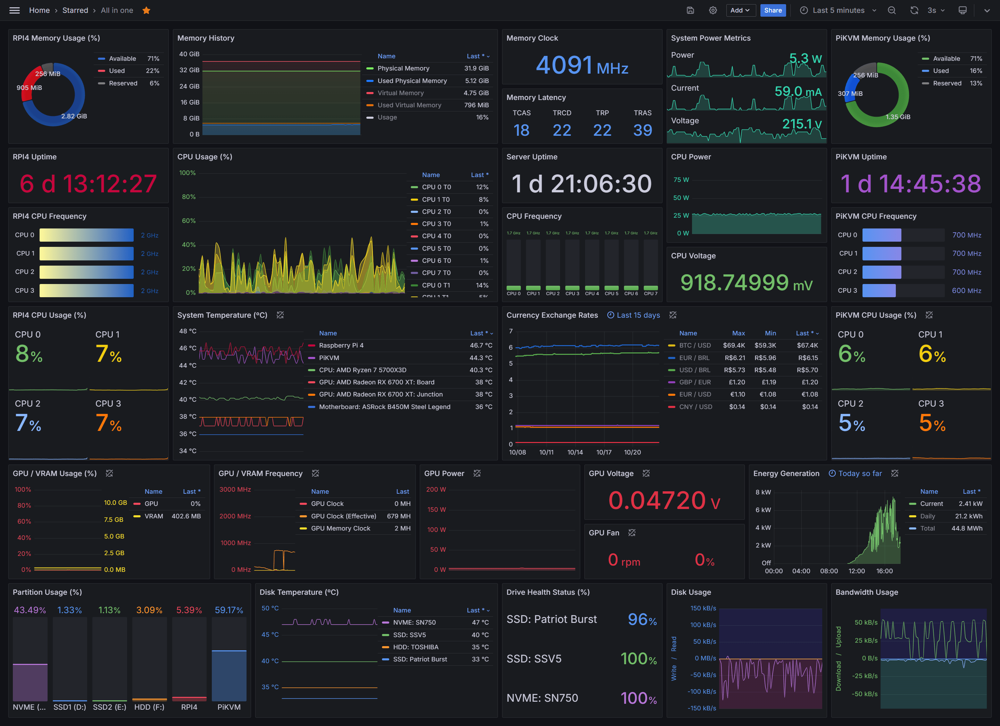

# CF-Server-Monitor Grafana Industrial Theme

> 专为 [CF-Server-Monitor](https://github.com/huilang-me/CF-Server-Monitor/) 打造的高精度 Grafana 工业级深色监控仪表盘主题。



---

## 🚀 极速使用指南（推荐：后台自定义主题 URL）

本主题构建产物已独立发布在 [`release`](https://github.com/selectarget/cfsm-theme-grafana/tree/release) 分支，无需自行打包部署。

进入您的 **CF-Server-Monitor 管理后台** (`/admin#admin`) ➔ **【外观设置】** ➔ 在 **【自定义主题 URL】** 填入以下地址之一并保存：

### 📌 方式 A：固定版本 Commit ID（官方最推荐，安全稳定）
```text
https://github.com/selectarget/cfsm-theme-grafana/tree/cc30d800d3e3b3540e9b81624601177856ee45a7
```

### 🔄 方式 B：自动跟进最新版（Release 分支）
```text
https://github.com/selectarget/cfsm-theme-grafana/tree/release
```

保存后刷新前台主页，即可立刻生效！

---

## 🌟 特性亮点

- 🎛️ **1:1 复刻 Grafana 工业暗黑风格**：
  - 深炭黑底色（`#111217` / `#181b1f`）、微细边框、荧光科技色调（绿、蓝、黄、橙、红、紫）。
- 🎨 **4 套精选工业配色方案（右上角调色盘一键切换）**：
  - **经典炭黑 (Grafana Classic)**：原汁原味官方暗黑工业风。
  - **赛博霓虹 (Cyberpunk Neon)**：极深曜石底色搭配激光青与电光紫高发光流线。
  - **极夜冷灰 (Nordic Slate)**：低饱和度北欧冰川蓝调，长时间盯盘护眼不疲劳。
  - **纯黑深邃 (OLED Pure Black)**：纯黑 `#000000` 背景，高对比度低功耗，大屏与 OLED 手机显示绝配。
  - 支持本地记忆并自动通过 `POST /api/theme_options` 保存至 Worker 后台。
- 📊 **核心面板组件库**：
  - **今日消耗总流量 (Today's Total Traffic)**：首页大盘醒目大字看板，细分下载与上传。
  - **每日消耗流量堆叠柱状图 (Daily Traffic Consumption)**：清晰呈现最近 7 天每天的进出吞吐与合计流量。
  - **Donut 环形图**：内存、磁盘容量比例与多色动态图例。
  - **Big Stat 大字看板**：Uptime 运行时间（`6 d 13:12:27`）、时钟频率、核心电压，带发光霓虹特效。
  - **Time Series 时序折线/面积图**：支持透明渐变发光填充、多曲线叠加、正负轴对称镜像吞吐图（Bandwidth & Disk Usage）。
  - **Bar Gauge 进度条**：支持横向（CPU 频率）与纵向（分区容量水位柱）。
- 🌐 **完整中英双语 (i18n)**：
  - 顶栏一键切换 `ZH / EN`，自动适配浏览器语言，并支持后台外观默认语言配置。
- 📱 **移动端全响应式自适应 (Mobile Responsive)**：
  - 针对手机、平板、桌面端弹性自适应排版，图表与顶部控件平滑折行无横向溢出。
- ⚡ **无缝契合官方第三方主题开发规范**：
  - 产物严格输出为标准的 `index.html` 与 `assets/` 静态目录，无冗余多余文件。
  - 严格支持 Hash 路由：首页 `/#/`、详情页 `/#/server/:id`。
  - 管理后台入口链接规范跳转至 `/admin#admin`。
  - 底部规范输出 `Powered by CF-Server-Monitor [v版本]`。
  - 监听 `document.visibilitychange`：页面切到后台自动断开以节省 Cloudflare Worker 额度，切回前台自动恢复并同步数据。
  - 内置 **Demo Preview 离线预览模式**：在无后端或本地直开时自动生成高保真实时数据。

---

## 🛠️ 本地开发与手动构建

### 1. 安装依赖
```bash
npm install
```

### 2. 本地开发调试
```bash
npm run dev
```
打开 `http://localhost:5173` 即可预览仪表盘。

### 3. 生产打包
```bash
npm run build
```
打包生成 `dist/` 目录：
```text
dist/
├── index.html
└── assets/
    ├── index-xxx.css
    └── index-xxx.js
```

---

## 🌐 独立纯静态托管（GitHub Pages / Vercel）

若想脱离 Worker 前端独立托管：
1. 在源站 Cloudflare Worker 环境变量中添加 `CORS_ALLOWED_ORIGINS`，填入您的静态域名（如 `https://yourname.github.io`）。
2. 在 `index.html` 的 `<head>` 中填入 Worker 地址：
   ```html
   <meta name="apiBase" content="https://monitor.yourdomain.com">
   ```

---

## 📄 License
MIT License
